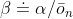
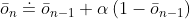
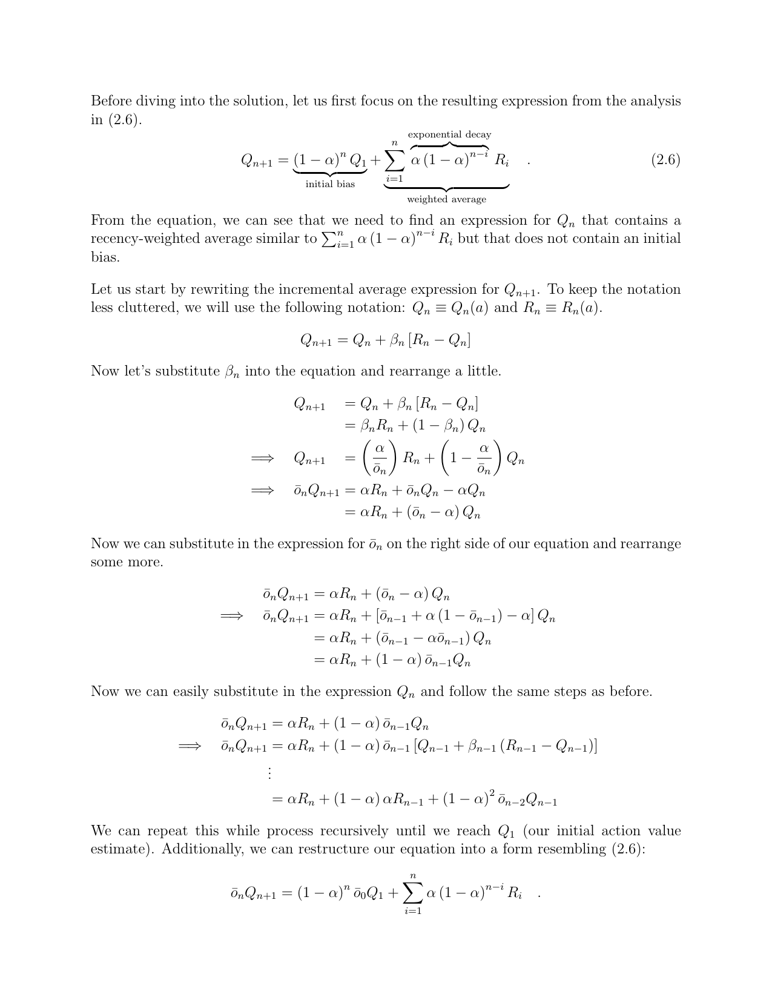
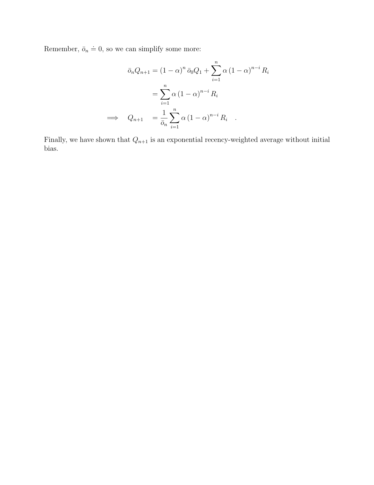

# Exercise 2.7

## Question:
In most of this chapter we have used sample averages to estimate action values
because sample averages do not produce the initial bias that constant step sizes
do (see the analysis leading to (2.6)). However, sample averages are not a
completely satisfactory solution because they may perform poorly on
nonstationary problems. Is it possible to avoid the bias of constant step sizes
while retaining their advantages on nonstationary problems? One way is to use a
step size of

to process the nth reward for a particular action, where _α_ > 0 is a
conventional constant step size, and _ōₙ_ is a trace of one that starts at 0:

Carry out an analysis like that in (2.6) to show that _Qₙ_ is an exponential
recency-weighted average _without initial bias_.

## Answer:

